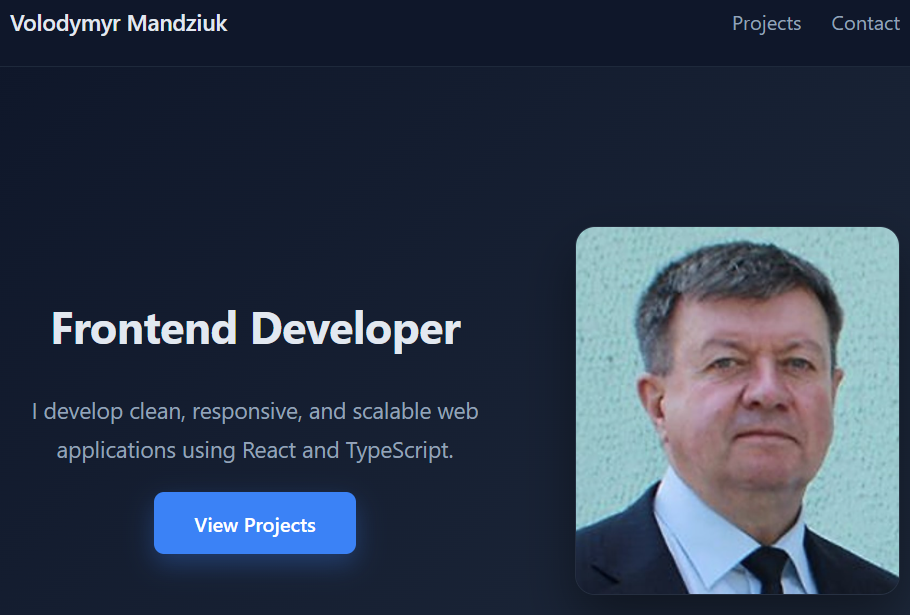
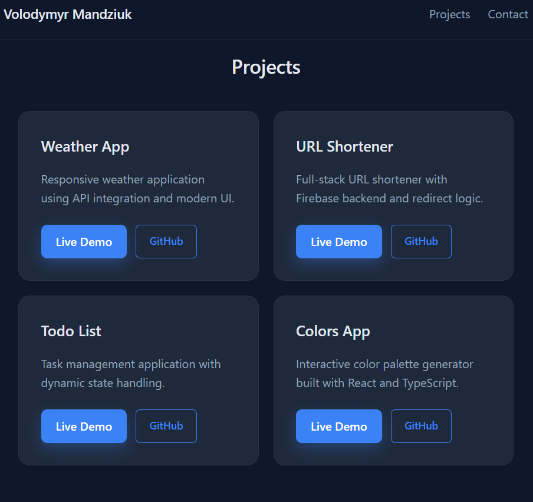
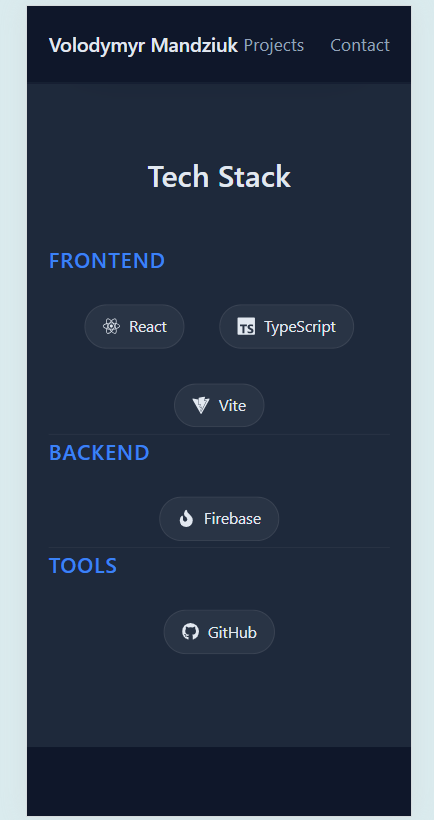

# 🚀 Portfolio Website

A modern and responsive **personal portfolio website** built with **Vite, React, and TypeScript**.  
It showcases my projects, technical skills, and contact information in a clean and minimal design.

### 🔗 Live Demo
👉 https://my-portfolio-841e6.web.app/portfolio-main

---

## ✨ Features

- 🎨 Modern responsive UI
- 🧩 Modular component structure
- 🛠 Tech stack section with categorized technologies
- 📦 Projects showcase with live links
- 📧 Clickable email (mailto)
- 📋 Copy-to-clipboard functionality (email & GitHub)
- 🔗 External GitHub profile link
- 📱 Fully responsive layout (desktop, tablet, mobile)
- 🌙 Clean dark-themed design

---

## 🛠 Tech Stack

- **Frontend:** React, TypeScript, Vite
- **Icons:** React Icons
- **Styling:** Custom CSS
- **Deployment:** Firebase Hosting

---

## 📸 Screenshots

### Hero Section



### Project Section



### Mobile View



---

## 🚀 Getting Started

### Install & Run Locally

```bash
npm install
npm run dev
```

## 📂 Project Structure 

src/
 ├── components/
 │    └── Navbar.tsx
 ├── sections/
 │    ├── HeroSection.tsx
 │    ├── TechStackSection.tsx
 │    ├── ProjectsSection.tsx
 │    └── ContactSection.tsx
 ├── styles/
 ├── App.tsx
 └── main.tsx 

 ## 📬 Contact 

 - **Email:** vmandziuk@gmail.com
 - **GitHub:** https://github.com/Volodymyr-Mandziuk 

 ## ⭐ Feel free to fork, explore, or use as inspiration!


---


